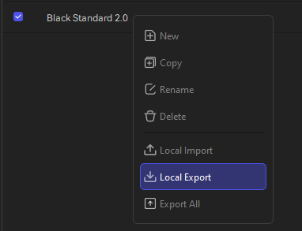

# Satellite-Resin

Conversion scripts for  ELEGOO satelLite resin profiles to ease out the resin mapping.

- You need python and install the dependency packages, see requirements.txt

- Export resin setting or settings from elegoo satelLite. As in image below.

- Convert Satres to 'human-readable' yaml.
  `python.exe .\satellite-resin.py elegoo-black-standard.yaml`

- Generate a yaml "diff" file of the setting you want to add or alter.
  - see anycubic-standard-beige.yaml as example

- Merge you own setting into existing Elegoo profile and export those to satellite resource files _.satres_ file that can be imported into Elegoo satelLite.
 `python.exe .\satellite-resin.py elegoo-black-standard.yaml -m anycubic-standard-beige -o anycubic-standard-beige.satres`

These scripts are genereted without any influence from Elegoo  and may produce unwanted behaviors. 

So check you settings after import.

## Anycubic

Anycubic resin settings are taken from Anycubic webpage. 
For Elegoo Saturn 4 Ultra 16k I have used Photon Mono M7 Pro settings with UV exposure set to 75 %.

## Yaml and Values

Current version expects the values in _yaml_ files to be stored in _'$'_ parameter having _'Value'_ ande _'Type'_ parameters. 
The  _'Type'_ parameter should correspond with the value type in _satres_ file.

Value types:
 - 1 - [0|0|0|0|0|0|0|1] integer (4 bytes)
 - 2 - [0|0|0|0|0|0|1|0] byte (2 bytes)
 - 5 - [0|0|0|0|0|1|0|1] long (8 bytes)
 - 6 - [0|0|0|0|0|1|1|0] float 
 - 10 -[0|0|0|0|1|0|1|0] string
 - 38 -[0|0|1|0|0|1|1|0] float ( with 3 decimals )
    
Some values can repeated like _scripcustomtnum_, that must have value of segments as in _scripcustomtnum[d]_, where _[d]_ is raising integer starting from 0.
